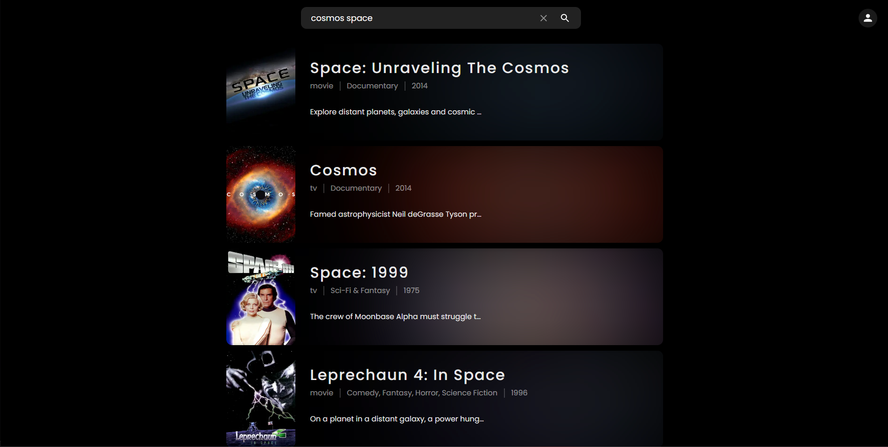
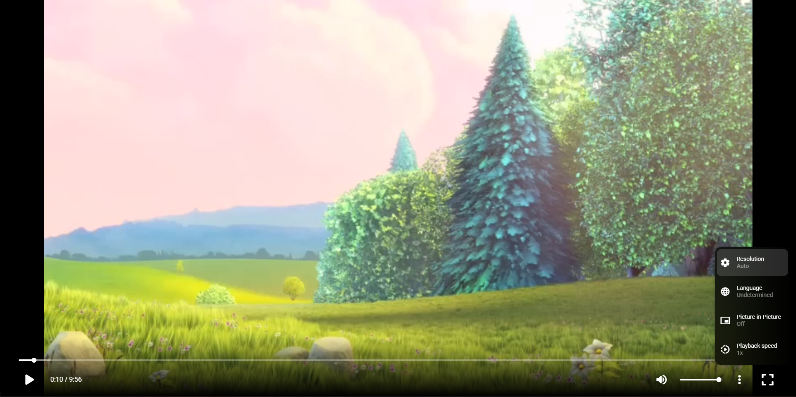

# 🎬 Streaming Service

This project is a streaming service developed for a college project. It is built using **Next.js**, **MongoDB**, and **Framer Motion**. The streaming service allows users to search for movies and series, upload their own movies, and includes user authentication and an admin panel.

## ✨ Features

- Search Movies and Series
- Play Trailer of movies and series
- User Authentication
- Admin Panel
- Upload Movies
- Manage Users

## 📸 Screenshots

- **Home Page**
  
  
  
- **Search**

  
  
  
- **Title Page**
  
  
  
  
  
- **User Authentication**
  
  
  
  
- **Uploading Movies**
  
  
  
- **Managing Users**
  
  
  
- **Video Player**
  
  
